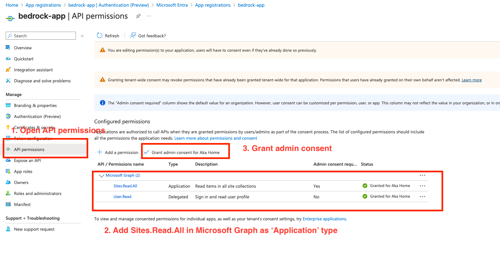

# AgentCore Gateway Demos

Connect AWS Bedrock Agent Core Gateway to Microsoft services using OAuth 2.0. Get AI agents reading SharePoint data in minutes.

## 🎯 What This Does

Enables secure integration between AWS Bedrock agents and Microsoft services:
- **OAuth 2.0 authentication** with Microsoft Graph API
- **SharePoint access** for AI agents via Agent Core Gateway
- **Complete testing toolkit** with debugging tools
- **Step-by-step setup** with visual guides

## 🚀 Quick Start: SharePoint Integration

### Prerequisites
- Azure tenant with admin access
- Python 3.12+
- AWS Bedrock Agent Core Gateway

### Step 1: Register Azure Application

1. **Create app registration** in Microsoft Entra Admin Center
   - Name: Choose any friendly name
   - Account types: "Accounts in this organizational directory only"


2. **Add API permissions**: Microsoft Graph → Application permissions → **Sites.Read.All**



3. **Grant admin consent** for the permission

4. **Create client secret** and note:
   - Client ID
   - Client Secret  
   - Tenant ID (from Entra admin center Home)


### Step 2: Test OAuth Flow (Optional)

Verify your Azure setup works:

```bash
cd oauth-tester
pip install -r requirements.txt

python oauth_tester.py client-credentials \
  --provider microsoft \
  --tenant-id <your-tenant-id> \
  --client-id <your-client-id> \
  --client-secret <your-client-secret>
```

**Expected result**: Access token with `"roles": ["Sites.Read.All"]`

### Step 3: Test SharePoint Access (Optional)

```bash
cd sharepoint

# Verify token works
python sharepoint_client.py --token <access-token> --action test-token

# List your SharePoint sites  
python sharepoint_client.py --token <access-token> --action list-sites
```

### Step 4: Configure Agent Core Gateway

1. **Add OAuth client** in AgentCore Identity with your Azure credentials:


2. **Add SharePoint target** in Agent Core Gateway:


> **Need help creating a gateway?** See [Creating your Gateway](https://docs.aws.amazon.com/bedrock-agentcore/latest/devguide/create-gateway-methods.html)

### Step 5: Get Cognito Access Token

Agent Core Gateway uses Cognito for inbound authentication. Get the token:

1. **Find token endpoint** from your gateway's discovery URL:
   ```
   https://xxxxxxxxxxxx.auth.ap-southeast-2.amazoncognito.com/oauth2/token
   ```

2. **Find Cognito user pool ID** from the same discovery URL:


3. **Navigate to Cognito** and find your user pool:


4. **Get client credentials** from App Clients section:


5. **Request access token**:
   ```bash
   curl -X POST YOUR_TOKEN_ENDPOINT \
     -H "Content-Type: application/x-www-form-urlencoded" \
     -d "grant_type=client_credentials&client_id=YOUR_CLIENT_ID&client_secret=YOUR_CLIENT_SECRET"
   ```

### Step 6: Test with MCP Inspector

1. **Start MCP Inspector**:
   ```bash
   npx @modelcontextprotocol/inspector
   ```

2. **Connect to your gateway**:
   - Transport: "Streamable HTTP"
   - URL: Your Gateway resource URL
   - Bearer Token: Cognito access token from Step 5

3. **Test SharePoint tools**:
   - Click "List Tools" → Should show `getSite`, `addSheet`, etc.
   - Get site ID from SharePoint client: `python sharepoint_client.py --token <token> --action list-sites`
   - Test `getSite` with your site ID


**Success!** Your AI agents can now access SharePoint data:


## 🔧 Troubleshooting

### OAuth Issues
| Problem | Solution |
|---------|----------|
| "Permission denied" | Use **Microsoft Graph** permissions, not SharePoint API |
| "Invalid scope" | Use `.default` scope for Client Credentials |
| "Unauthorized" | Ensure admin consent is granted |
| "No roles in token" | Wait 5-10 minutes after granting consent |

### Quick Diagnostics
- **Check JWT token**: Look for `"roles": ["Sites.Read.All"]` field
- **Use verbose mode**: Add `--verbose` flag to commands
- **Verify permissions**: Check Azure portal for green checkmarks

## 📁 What's Included

```
├── oauth-tester/           # OAuth 2.0 testing toolkit
├── sharepoint/            # SharePoint API client  
└── oauth-cheatsheet.md    # OAuth flows reference
```

Each folder has its own README with detailed usage instructions.


